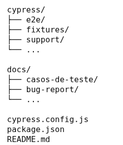
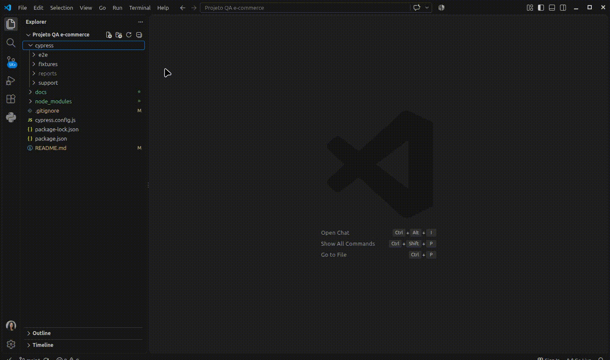
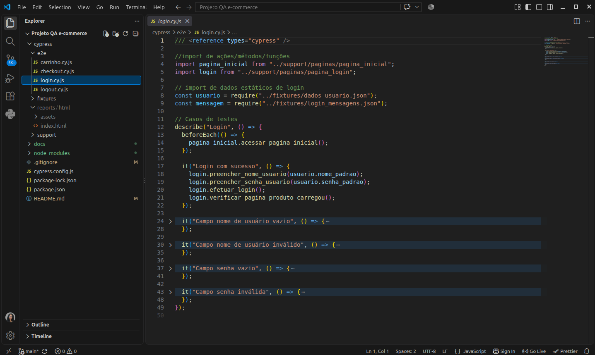
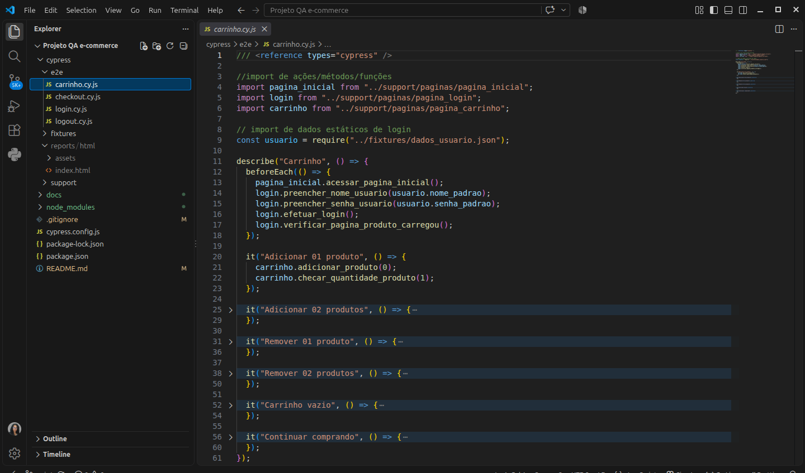
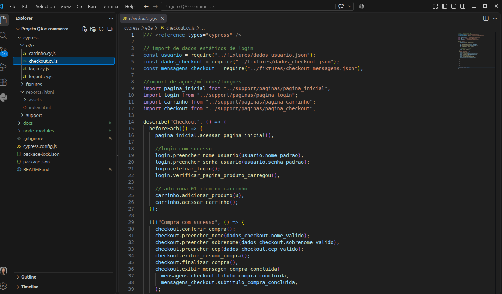
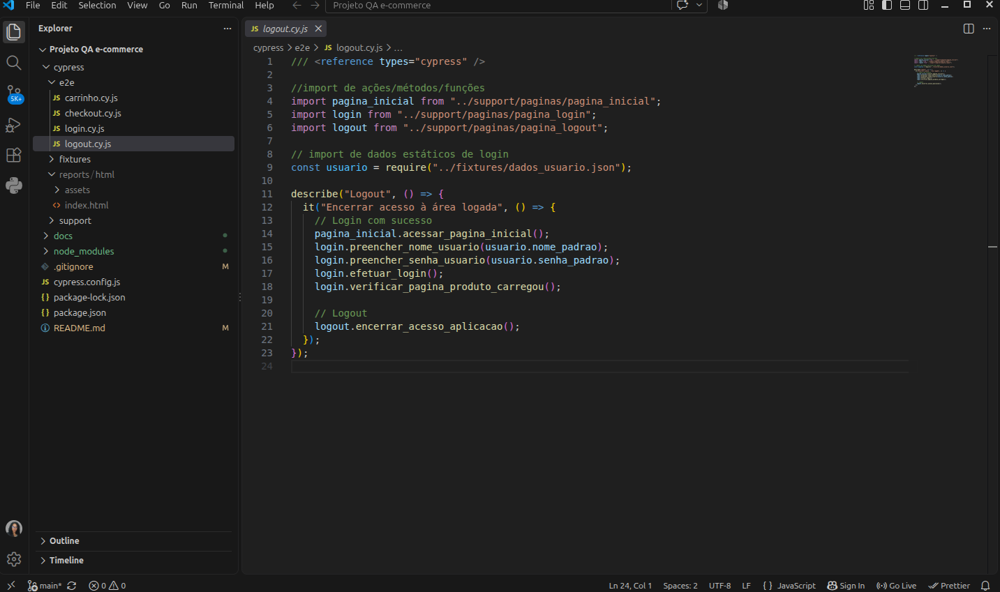
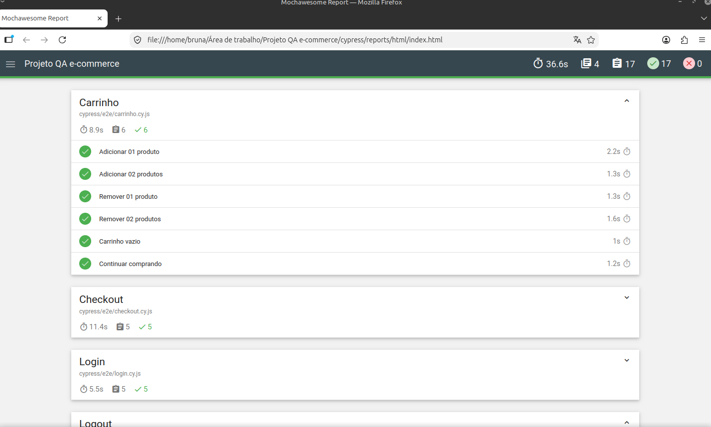
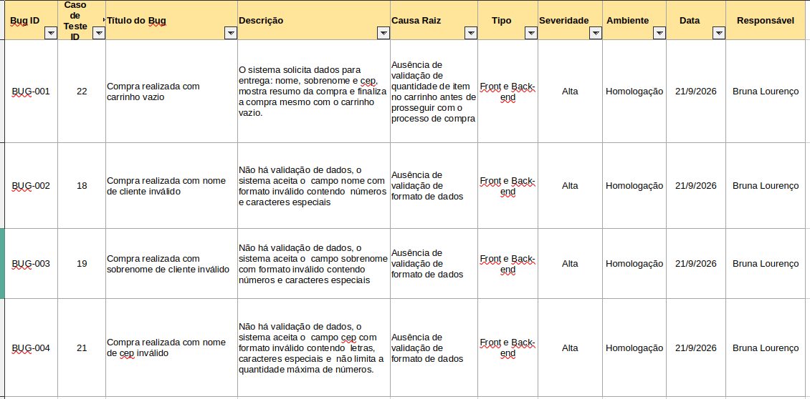

# Projeto QA - Automação de testes e2e em e-commerce com Cypress

# Objetivo

Projeto pessoal de QA voltado para testes manuais, funcionais, exploratórios e automatizados E2E utilizando Cypress em uma aplicação de e-commerce (Sauce Demo). Ao todo foram elaborados 25 casos de testes e encontrados 04 bugs.

O objetivo é validar os principais fluxos de uma loja virtual, identificar defeitos e demonstrar a automação dos cenários mais relevantes.

Para isso, foram testados os fluxos de login, logout, carrinho, produto e checkout e foram desconsiderados os fluxos de validações de valores de produtos no carrinho por estarem fora do escopo desse projeto.

## Métricas do projeto por técnica de testes

|Descrição   |  Manual  | Automatizado |
| ------------- | :------: | :----------: |
|Funcionalidades testadas   | 05   |    04     |
|Bugs encontrados | 04|  00|
|Casos de teste    |    25    |      21      |
| Cobertura de testes| 100% |   84%    |

Em relação a cobertura de 84% trata-se de 21 de 25 casos de teste documentados.

## Bugs encontrados

Dos 04 bugs encontrados em testes manuais, 03 são mensagens de validação de dados em formato inválidos no checkout que não foram implementadas e assim não apresentam mensagem de erro e por isso não foram automatizadas e o outro bug é referente a conclusão de compra com carrinho vazio, o sistema segue o fluxo normalmente e não é exibida mensagem de erro de carrinho vazio, dessa forma foi não viável automatizar esse cenário de teste.

   
## Estrutura do projeto

## Tecnologias utilizadas

- Cypress
- Node.js
- Google Chrome
- Excel
- VS Code
- Gitub
- ScreenToGif

## Funcionalidades testadas por técnica de teste

| Cenário       |  Manual  | Automatizado |
| ------------- | :------: | :----------: |
| Login         |    ✅    |      ✅      |
| Carrinho      |    ✅    |      ✅      |
| Checkout      |    ✅    |      ✅      |
| Logout        |    ✅    |      ✅      |
| Produto       |    ✅    |      ❌      |
| Total   |  **05**   |    **04**     |

No cenário Produto constam testes de ordenação de produtos por nome e preço, os fluxos dessas demandas não foram automatizados por 
estarem em fora do escopo proposto para automações desse projeto.

## Recursos utilizados

- Funções -> para reutilização de código e manutenabilidade posteriormente;
- Fixtures -> para manter dados estáticos/fixos para garantir maior consistência nos testes aplicados;
- Assertions -> para validar dados esperados x dados exibidos em determinadas ações no sistema;
- beforeEach() -> para reutilização de código e executar uma única vez, ações necessários para iniciar funções específicas;
- Relatório mochawasome -> para visualizar os resultados dos testes
- Page Objects -> para organizar scripts, separando código de elementos da aplicação e facilitar manutenção posteriormente.

## Artefatos produzidos

- [Estratégia de testes](./docs/estrategia.md) -> definição de abordagem, escopo e critérios de teste
- [Casos de teste](./docs/casos%20de%20testes/) ->cenários documentados em formato estruturado
- [Bug reports](./docs/bug%20report/) -> registro de defeitos encontrados durante execução dos testes
- [Automações](./cypress/e2e/) -> scripts em cypress
- [Evidências](./docs/evidencias/) -> imagens de testes executados   

## Como executar o projeto

Na pasta do projeto com o terminal aberto

- Necessário Node.js instalado;
- Executar no terminal o comando, para instalar dependências do projeto -> ``npm install``
- Para abrir o cypress digite ``npx cypress open``
- Irá abrir a tela de navegação do Cypress, utilizada para visualizar a execução dos testes e status
  

## Execução dos testes automatizados - vídeo
O vídeo mostra a execução de testes automatizados, desde o VS Code onde foram gerados os scripts, a execução no Cypress e no navegador Google Chrome onde a automação dos testes é feita por funcionalidade mostrando na tela o preenchimento com dados configurados, cliques e os fluxos acontecendo, simulando a utilização da aplicação por um usuário.

    

## Prints do projeto  

#### Casos de teste  
Descreve passo a passo para a execução dos testes manuais e automatizados.  
   

#### Testes automatizados de funcionalidades
**Login**
Print da tela de script com funções e imports necessários para execução dos testes de login  
    
**Carrinho**
Print da tela de script com funções e imports necessários para execução dos testes de carrinho  
    
**Checkout**
Print da tela de script com funções e imports necessários para execução dos testes de checkout  
    
**Logout**
Print da tela de script com funções e imports necessários para execução dos testes para encerrar acesso a área logada  
    

#### Relatório Mochawesome (testes automatizados)
Relatório dos testes executados
    

#### Bug Report
Planilha com os bugs encontrados, os prints dos erros encontram-se no artefato evidências, organizados de acordo com as ids dessa planilha 
   
